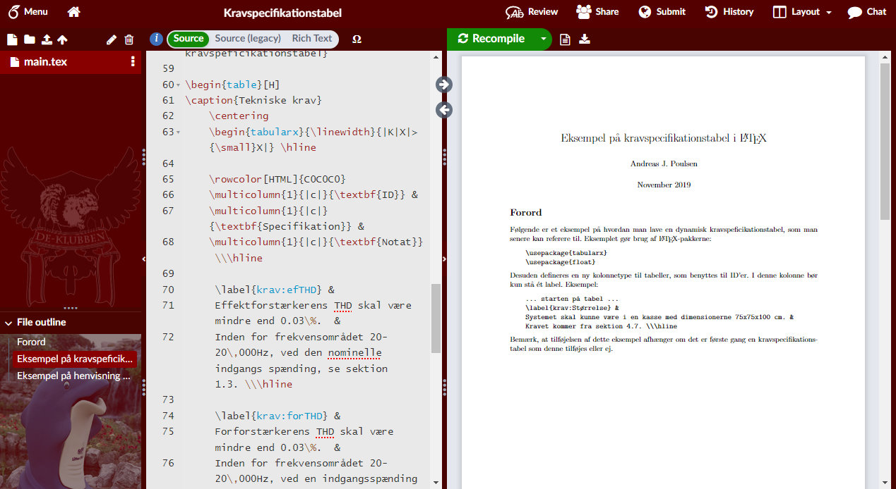

# DE-klubben theme for Overleaf
This theme sets the color theme of overleaf to match that of [DE-klubben](https://deklubben.dk/) as the attached university is so adament in using this service. The file ```expanded.css``` is the CSS as it was written before being (slightly) mimized to produce ```userstyle.css```. Use a tool such as [Stylus](https://github.com/stylus/stylus) to install this userstyle by adding ```userstyle.css``` as a new userstyle.

